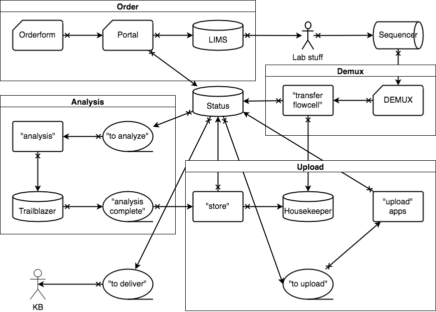

# cg

`cg` stands for _Clinical Genomics_; a clinical sequencing platform under [SciLifeLab][scilife].

This is our main package for interacting with data and samples that flow through our pipeline. We rely on a set of specialized "apps" to deal with a lot of the complexity like:

- [Trailblazer][trailblazer]: Python wrapper around MIP, a rare disease genomics pipeline
- [Housekeeper][housekeeper]: storage, retrieval, and archive of files
- [Genotype][genotype]: managing genotypes for detecting sample mix-ups

In this context, `cg` provides the interface between these tools to facilitate automation and other necessary cross-talk. It also exposes some APIs:

- HTTP REST for powering the web portal: [clinicalgenomics.now.sh][portal]
- CLI for interactions on the command line

## Team members

- [@ingkebil][ingkebil]: bioinformatics manager | 🇧🇪
- [@robinandeer][robinandeer]: lead developer, designer | 🇸🇪
- [@Dilea][Dilea]: bioinformatician, LIMS developer | 🇸🇪
- [@b4ckm4n][b4ckm4n]: bioinformatician | 🇸🇪
- [@moonso][moonso]: bioinformatician, Scout developer | 🇸🇪
- [@henrikstranneheim][henrikstranneheim]: bioinformatician, MIP developer | 🇸🇪

## Work flow

This is a schematic overview of how data flows between different tools. Generally things start in the top left corner:

1. **Order** | New samples are submitted by logging into the [portal][portal] and either uploading an "orderform" or supplying the information directly.

    Information is parsed and uploaded both to LIMS and to the central status database. These samples now end up in the [incoming queue](https://clinicalgenomics.now.sh/status/incoming).

2. **Lab** | Samples are worked on and monitored through in LIMS. This is true for all lab related activities up until sequencing. Samples are stuck in the [sequencing queue](https://clinicalgenomics.now.sh/status/sequencing) until they have reached sufficient reads according to the application tag.

    Samples are marked as having arrived in LIMS and this is also reflected by copying the date to the status database.

3. **Demux** | Samples are  picked up by the bioinformatics pipeline after sequencing. A demultiplexed flowcell will get added to `status` and FASTQ files for each samples will be sent to `housekeeper`. This updates the reads count for each associated sample and subsequently moves them along the chain.

4. **Analysis** | Families where all related samples have been sequenced show up in the [analysis queue](https://clinicalgenomics.now.sh/status/analysis). The runs are automatically started. Starting a run will do four things:

    1. Generate a pedigree config for the analysis pipeline
    2. Link FASTQ files for each related sample and rename to follow the pipeline conventions
    3. Generate a gene panel file according to the order
    4. Start the pipeline and setting the priority flag to high if required

    Samples with elevated priority ("priority" and "express") will be started first with the rest following in reverse chronological order.

5. **Store** | Completed analyses can be accessed through `trailblazer` and are automatically "stored". This process updated `status` and links files to the family in `housekeeper`.

    Some files are marked as essential and will be subsequently backed up. Other files will be automatically remove after 3 months.

6. **Upload** | Results from completed analyses gets uploaded to a range of different tools:

    - [Chanjo][chanjo]: coverage metrics
    - [Genotype][genotype]: genotypes for detecting sample mix-ups
    - LoqusDB: local observation counts for variants
    - [Scout][scout]: variant interpretation platform

7. **Delivery** | Delivery happens on two levels:

    - **Sample**: FASTQ-files are always delivered for every order. The default is delivery to the delivery server. We also support upload to UPPMAX and other generic servers for some collaborators. After delivery, `status` is updated with a final sample progress date.

    - **Family/Analysis**: some collaborators have opted into the Scout platform for delivery of annotated and ranked variants. These families are analyzed and uploaded which essentially corresponds to the "delivery" for such orders. We do, however, perform various quality checks before we finally answer out the results.

8. **Archive**: [@ingkebil][ingkebil]

## Responsibilities

Genomics platforms produce vasts amount of data and we deal with 1000s of samples every year. This leads to a rather complex interaction of tools and databases to handle this throughput. We also strive to automate as much of the processes as possible.

We therefore need to share responsibilities and monitoring between members of our team.

### Processes

- **Order**: [@robinandeer][robinandeer]
- **Demux**: [@ingkebil][ingkebil]
- **Analysis**: [@Dilea][Dilea]
- **Upload**: [@robinandeer][robinandeer]
- **Delivery**: [@b4ckm4n][b4ckm4n]
- **Archive**: [@ingkebil][ingkebil]

### Tools

- **LIMS**: [@Dilea][Dilea]
- **LoqusDB**: [@moonso][moonso]
- **Scout**: [@robinandeer][robinandeer] + [@moonso][moonso]
- **MIP**: [@henrikstranneheim][henrikstranneheim]

## Server

The REST API server handles a number of actions. It's written in [Flask][flask] and exposes an admin interface for quickly editing information in the backend MySQL database.

The API is protected by JSON Web Tokens generated by Google OAuth. It authorizes access using the user table in the internal database. The admin interface is served under a hidden route but the plan is to move it to Google OAuth as well.

### Order endpoint

The `/order` endpoint accepts orders for new samples. If you supply a JSON document on the expected format, a new order is open in `status` and LIMS.

[portal]: https://clinicalgenomics.now.sh/
[trailblazer]: https://github.com/Clinical-Genomics/trailblazer
[housekeeper]: https://github.com/Clinical-Genomics/housekeeper
[genotype]: https://github.com/Clinical-Genomics/genotype
[chanjo]: https://github.com/robinandeer/chanjo
[scout]: https://github.com/Clinical-Genomics/scout
[scilife]: https://www.scilifelab.se/
[flask]: http://flask.pocoo.org/
[ingkebil]: https://github.com/ingkebil
[robinandeer]: https://github.com/robinandeer
[Dilea]: https://github.com/Dilea
[b4ckm4n]: https://github.com/b4ckm4n
[moonso]: https://github.com/moonso
[henrikstranneheim]: https://github.com/henrikstranneheim
